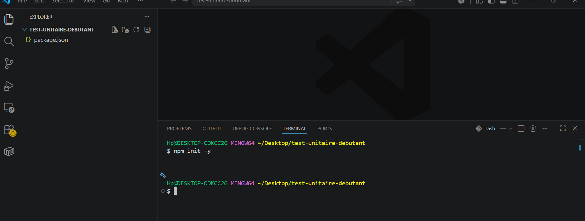
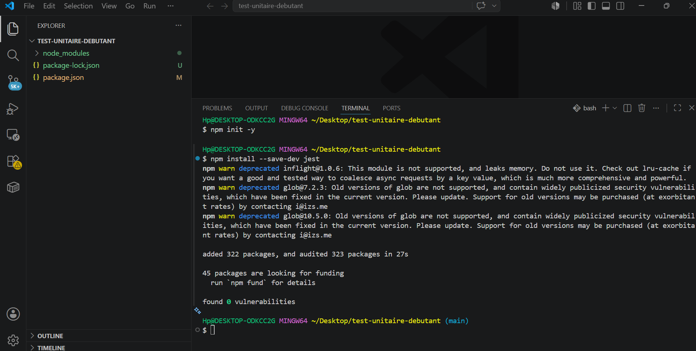
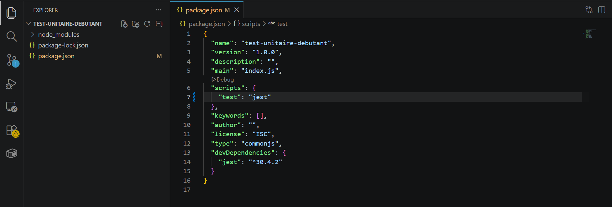
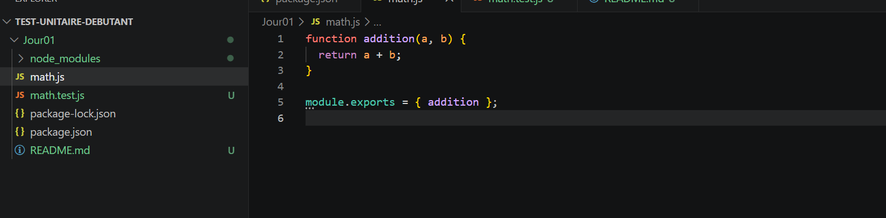
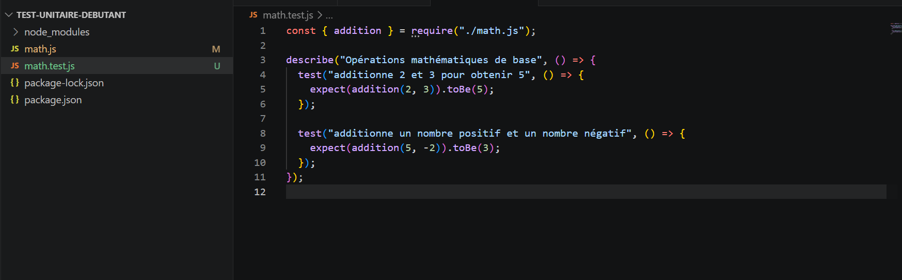
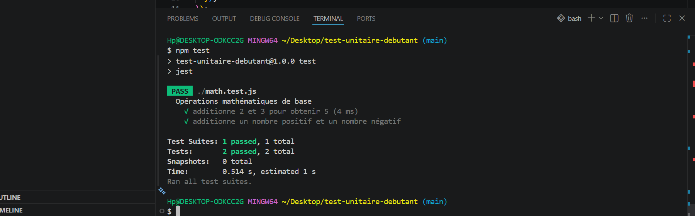
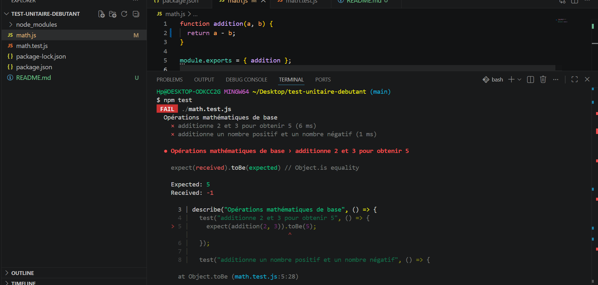
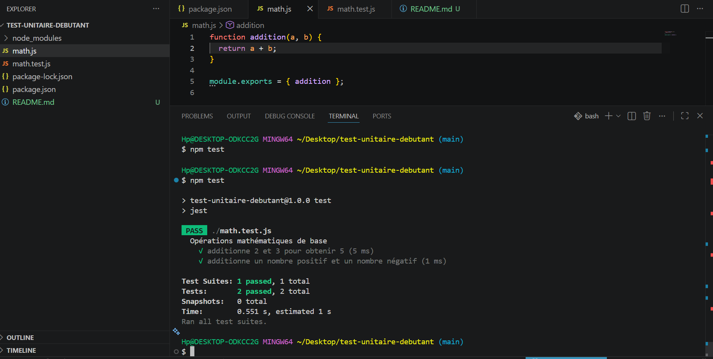

# 📦 Test Unitaire Débutant - Jest

## 🎯 Objectif du projet

Ce projet a pour objectif de découvrir les tests unitaires en JavaScript avec **Jest**.
Il consiste à créer une fonction simple (addition) et à la tester automatiquement.

---

## 🛠️ Technologies utilisées

- Node.js
- Jest
- JavaScript
- Git / GitHub

---

## 📁 Structure du projet

```
test-unitaire-debutant/
│
├── jour01/
│   ├── math.js
│   ├── math.test.js
│   ├── package.json
│   ├── node_modules/
│   └── images/
│       ├── capture_1.png
│       ├── capture_2.png
│       ├── capture_3.png
│       ├── capture_4.png
│       ├── capture_5.png
│       ├── capture_6.png
│       ├── capture_7.png
│       └── capture_8.png
```

---

## 🚀 Étapes du projet

---

## 1️⃣ Initialisation du projet Node.js

Commande :

```
npm init -y
```

📸 Capture :



---

## 2️⃣ Installation de Jest

Commande :

```
npm install --save-dev jest
```

📸 Capture :



---

## 3️⃣ Configuration du script de test

Ajout dans `package.json` :

```
"scripts": {
  "test": "jest"
}
```

📸 Capture :



---

## 4️⃣ Création de la fonction

Fichier : `math.js`

```
function addition(a, b) {
  return a + b;
}

module.exports = { addition };
```

📸 Capture :



---

## 5️⃣ Création des tests unitaires

Fichier : `math.test.js`

📸 Capture :



---

## 6️⃣ Exécution des tests (succès)

Commande :

```
npm test
```

📸 Capture :



---

## 7️⃣ Test en erreur (échec volontaire)

Modification de la fonction :

```
function addition(a, b) {
  return a - b; // erreur volontaire
}
```

📸 Capture :



---

## 8️⃣ Correction et retour au succès

Correction de la fonction :

```
function addition(a, b) {
  return a + b;
}
```

Relance des tests :

```
npm test
```

📸 Capture :



---

## 🧠 Compétences acquises

- Initialisation d’un projet Node.js
- Installation et configuration de Jest
- Création de fonctions JavaScript simples
- Écriture de tests unitaires
- Compréhension des erreurs et debugging
- Utilisation de Git et documentation Markdown

---

## ✅ Conclusion

Ce projet permet de comprendre l’intérêt des tests unitaires :
ils garantissent que le code fonctionne correctement et permettent de détecter rapidement les erreurs lors de modifications.
