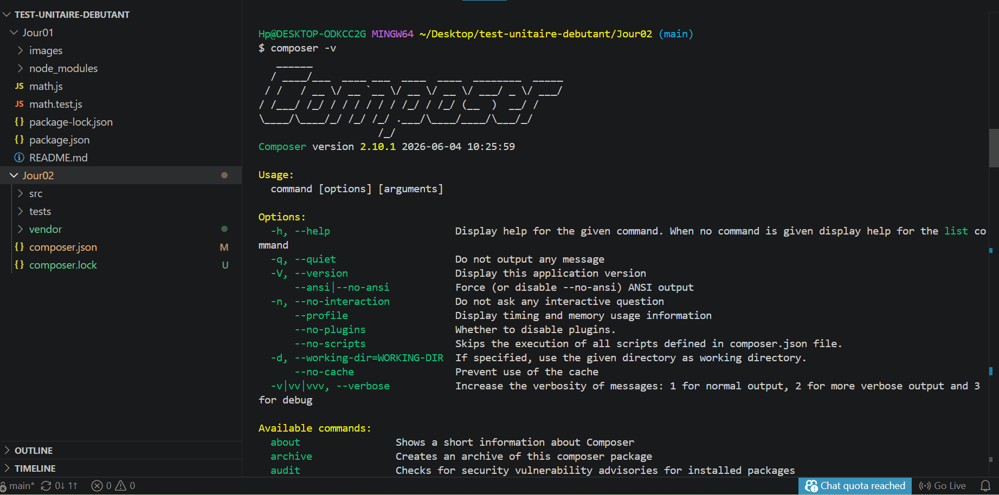
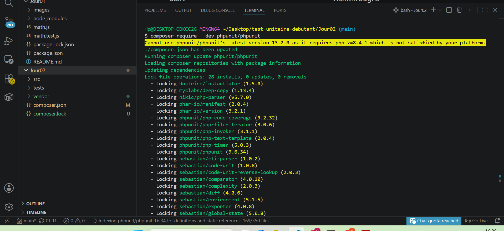
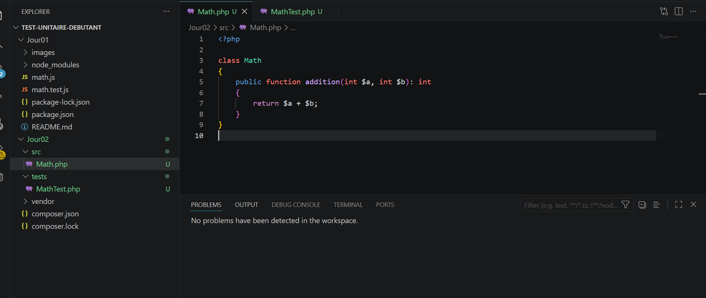
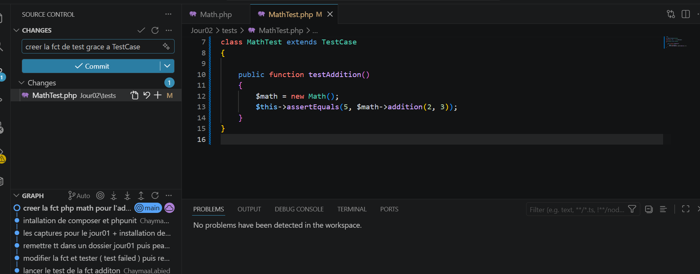
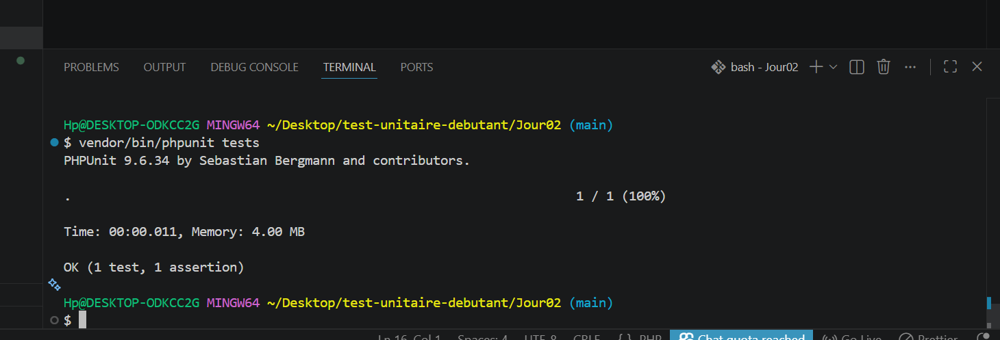
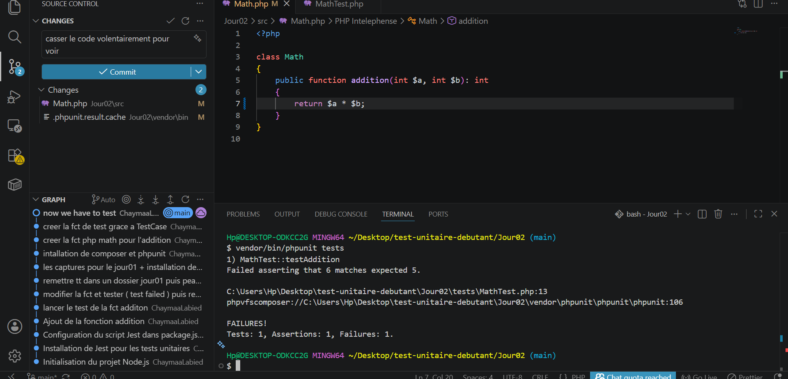
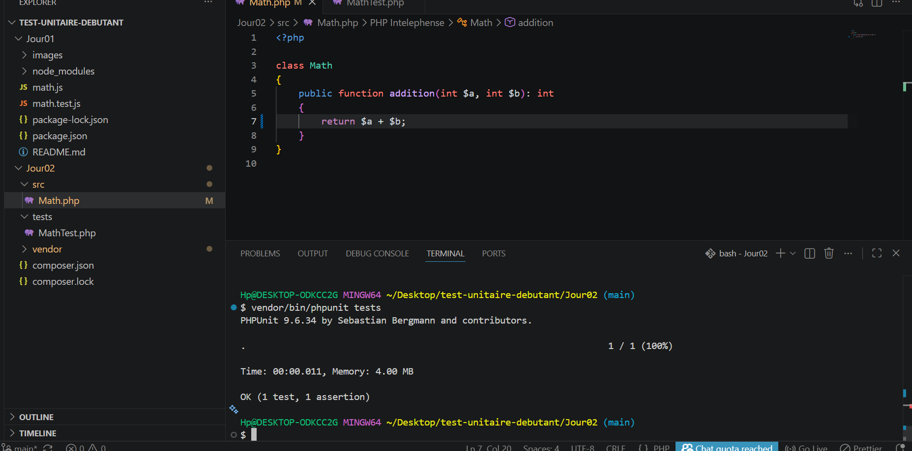

# 📦 Test Unitaire PHP - Jour 02 (PHPUnit)

## 🎯 Objectif du projet

Ce projet a pour objectif de découvrir les tests unitaires en PHP avec **PHPUnit**.
On crée une classe simple et on vérifie son bon fonctionnement grâce à des tests automatisés.

---

## 🛠️ Technologies utilisées

- PHP 7.4
- Composer
- PHPUnit 9
- Git / GitHub

---

## 📁 Structure du projet

```text
test-unitaire-php-debutant/
│
├── src/
│   └── Math.php
│
├── tests/
│   └── MathTest.php
│
├── images/
│   ├── capture_1.png
│   ├── capture_2.png
│   ├── capture_3.png
│   ├── capture_4.png
│   ├── capture_5.png
│   ├── capture_6.png
│   ├── capture_7.png
│
├── vendor/
├── composer.json
├── composer.lock
└── README.md
```

---

## 🚀 Étapes du projet

---

## 1️⃣ Vérification de Composer

Commande :

```bash
composer -v
```

📸 Capture 1 : Composer installé et fonctionnel

## 

## 2️⃣ Initialisation du projet

Commande :

```bash
composer init
```

📸 Capture 2 : création du fichier composer.json


---

## 3️⃣ Installation de PHPUnit

Commande :

```bash
composer require --dev phpunit/phpunit
```

📸 Capture 3 : installation de PHPUnit et création du dossier vendor


---

## 4️⃣ Création de la classe Math

Fichier : `src/Math.php`

```php
<?php

class Math
{
    public function addition(int $a, int $b): int
    {
        return $a + $b;
    }
}
```

📸 Capture 4 : création de la classe Math


---

## 5️⃣ Création du test unitaire

Fichier : `tests/MathTest.php`

```php
<?php

use PHPUnit\Framework\TestCase;

require_once __DIR__ . '/../src/Math.php';

class MathTest extends TestCase
{
    public function testAddition()
    {
        $math = new Math();
        $this->assertEquals(5, $math->addition(2, 3));
    }
}
```

📸 Capture 5 : création du test PHPUnit


---

## 6️⃣ Exécution des tests (succès)

Commande :

```bash
vendor/bin/phpunit tests
```

📸 Capture 6 : test réussi (OK)


---

## 7️⃣ Test en erreur volontaire

Modification de la méthode :

```php
public function addition(int $a, int $b): int
{
    return $a * $b; // erreur volontaire
}
```

Résultat : test en échec

📸 Capture 7 : test FAIL (erreur détectée par PHPUnit)


---

## 8️⃣ Correction et retour au succès

Correction de la fonction :

```php
public function addition(int $a, int $b): int
{
    return $a + $b;
}
```

Relance des tests :

```bash
vendor/bin/phpunit tests
```

📸 Capture 7 : retour au succès (OK)


---

## 🧠 Compétences acquises

- Installation de Composer
- Installation de PHPUnit
- Création de classes PHP
- Écriture de tests unitaires
- Compréhension des erreurs
- Debugging avec tests
- Organisation d’un projet PHP

---

## ✅ Conclusion

Ce projet permet de comprendre l’importance des tests unitaires en PHP.
Ils garantissent que le code fonctionne correctement et permettent de détecter rapidement les erreurs lors des modifications.
