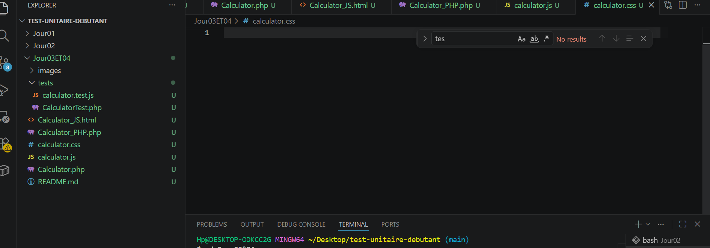
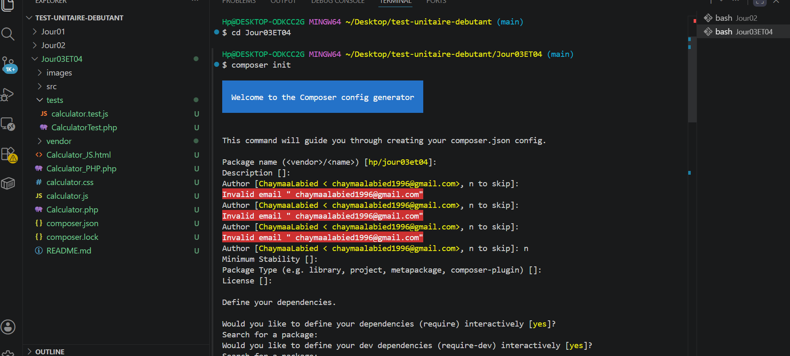
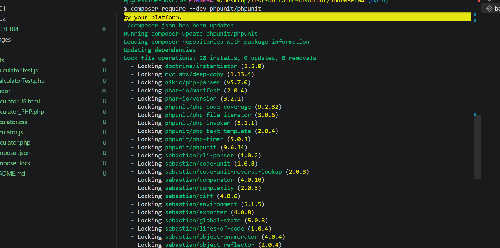
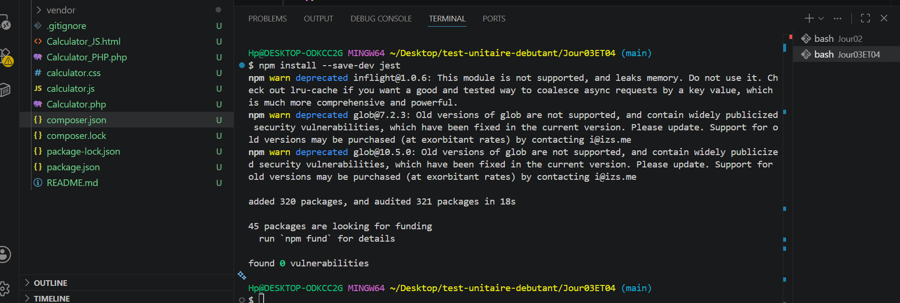
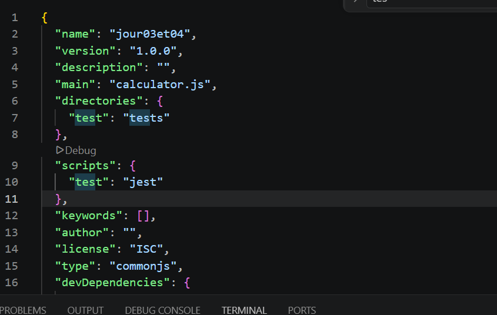
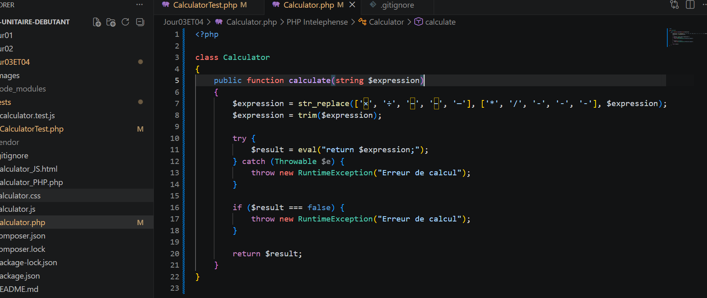
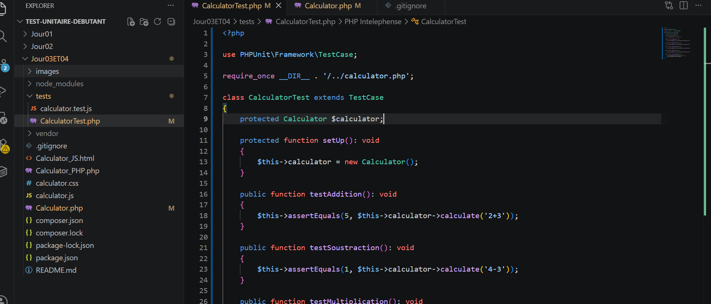
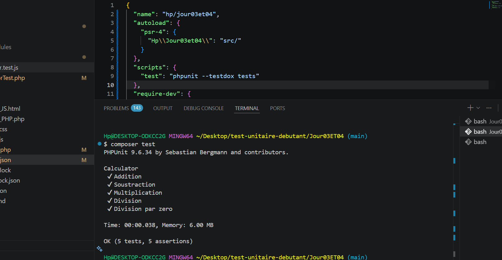
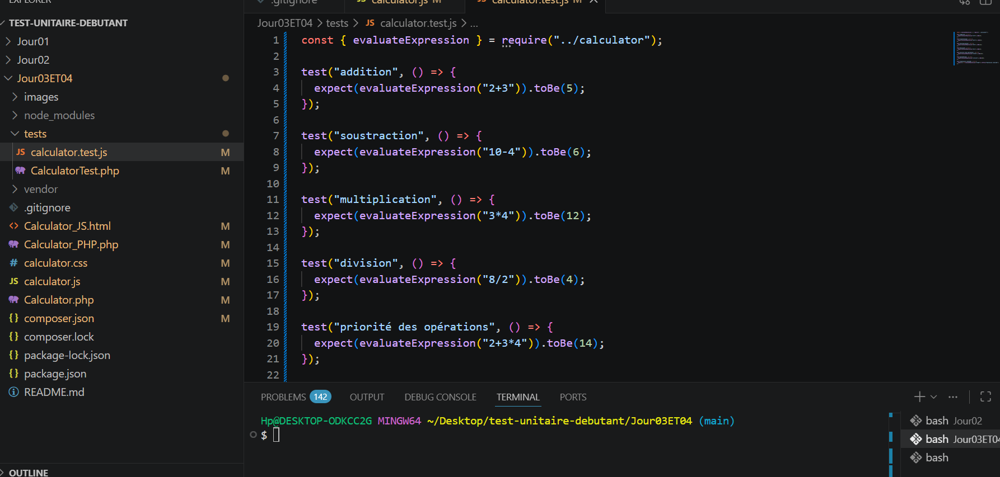

# 📦 Test Unitaire Débutant - PHP & JavaScript Calculator

## 🎯 Objectif du projet

Ce projet a pour objectif de découvrir et appliquer les tests unitaires en **PHP (PHPUnit)** et en **JavaScript (Jest)**.

Il consiste à tester une calculatrice fonctionnelle en vérifiant la logique de calcul :

- opérations de base
- gestion des erreurs
- priorités mathématiques
- expressions complexes

---

## 🛠️ Technologies utilisées

- PHP
- PHPUnit
- JavaScript (ES6)
- Jest
- HTML / CSS
- Node.js
- Git / GitHub

---

## 📁 Structure du projet

test-unitaire-debutant/
│
├── Calculator.php
├── Calculator_PHP.php
├── calculator.js
├── Calculator_JS.html
├── calculator.css
│
├── tests/
│ ├── CalculatorTest.php
│ ├── calculator.test.js
│
├── images/
│ ├── capture_1.png
│ ├── capture_2.png
│ ├── capture_3.png
│ ├── capture_4.png
│ ├── capture_5.png
│ ├── capture_6.png
│ ├── capture_7.png
│ ├── capture_8.png
│ ├── capture_9.png

---

## 🚀 [Étapes du projet]

---

## 1️⃣ [Initialisation du projet]

📸 Capture :

---

## 2️⃣ [Initialisation Composer]

📸 Capture :

---

## 3️⃣ [Installation de PHPUnit]

📸 Capture :

---

## 4️⃣ [Création de la logique PHP]

Fichier : `Calculator.php`

📸 Capture :

---

## 5️⃣ [Création des tests PHPUnit]

Fichier : `tests/CalculatorTest.php`

📸 Capture :

---

## 6️⃣ [Exécution des tests PHP]

📸 Capture :

---

## 7️⃣ [Installation de Jest]

📸 Capture :

---

## 8️⃣ [Configuration Jest]

📸 Capture :

---

## 9️⃣ [Création des tests JavaScript]

Fichier : `tests/calculator.test.js`

📸 Capture :

---

## 🔟 [Exécution des tests JavaScript]

✔ Tous les tests passent avec succès

---

## 🧠 [Compétences acquises]

- Création d’un projet structuré
- Utilisation de Composer et PHPUnit
- Mise en place de Jest
- Écriture de tests unitaires
- Gestion des cas d’erreurs
- Organisation d’un projet Git propre

---

## ✅ [Conclusion]

Ce projet permet de comprendre l’importance des tests unitaires :

✔ Fiabiliser le code  
✔ Détecter les erreurs rapidement  
✔ Sécuriser les fonctions de calcul  
✔ Structurer un projet proprement
